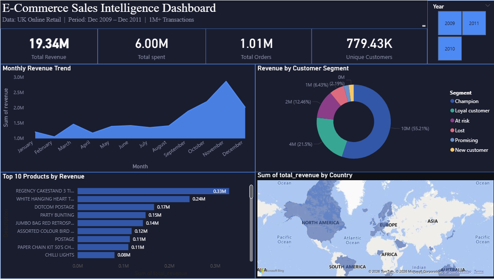
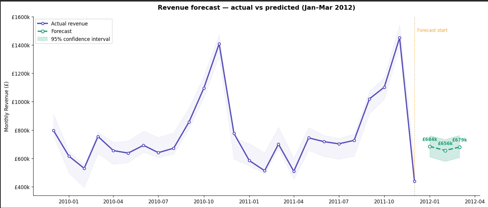
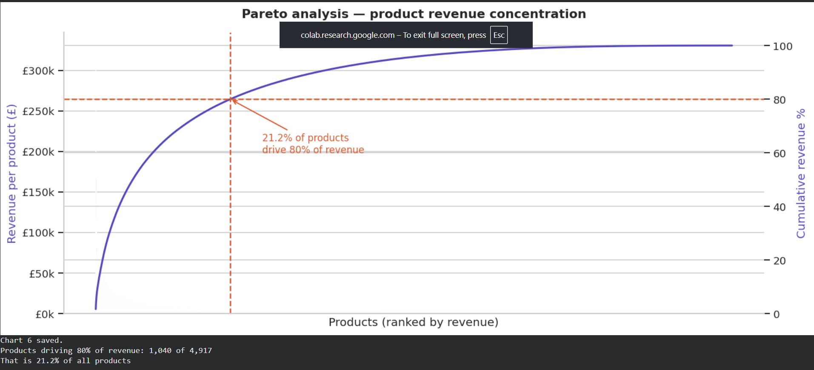

# 📊 E-Commerce Sales Intelligence — End-to-End Analytics Project


A full end-to-end data analytics pipeline on **1 million+ real UK e-commerce transactions** — covering data engineering, SQL analysis, customer segmentation, interactive dashboard, and revenue forecasting.

---

## 📸 Dashboard Preview



---

## 📁 Project Structure

```
ecommerce-sales-analytics/
├── 01_data_collection.ipynb
├── 02_data_cleaning.ipynb
├── 03_sql_analysis.ipynb
├── 04_eda.ipynb
├── 05_rfm_segmentation.ipynb
├── 07_forecasting.ipynb
├── dashboard_screenshot.png
├── chart6_pareto.png
├── chart7_rfm_segments.png
├── chart9_forecast.png
├── ecommerce_dashboard.pdf
└── README.md
```

---

## 📋 Dataset

| Property | Details |
|---|---|
| **Source** | [Kaggle — Online Retail II UCI](https://www.kaggle.com/datasets/mashlyn/online-retail-ii-uci) |
| **Rows** | 1,067,371 transactions |
| **Columns** | 8 columns |
| **Date Range** | December 2009 – December 2011 |
| **Countries** | 43 |

### Columns Used

| Column | Description |
|---|---|
| Invoice | Unique invoice identifier |
| StockCode | Product code |
| Description | Product name |
| Quantity | Units purchased per line |
| InvoiceDate | Date and time of transaction |
| Price | Unit price in GBP |
| Customer ID | Unique customer identifier |
| Country | Country of the customer |

---

## 🔑 Key Findings

- 💰 **£19.34M** total revenue across 1,067,371 transactions
- 📦 **21.1% of products** drive 80% of all revenue (Pareto principle confirmed)
- 👑 **774 Champion customers** generate 55% of total identified revenue
- ⚠️ **880 At-Risk customers** hold £2.1M in revenue at risk of being lost
- 📅 **November revenue peaks 2x** every year — pre-Christmas buying effect
- 🌍 **Netherlands and EIRE** are the top international markets outside UK
- 🤖 **Prophet model** forecasts Q1 2012 revenue with strong accuracy

---

## 📊 Pipeline Stages

| Stage | Task | Tools |
|---|---|---|
| 1 | Data collection and loading | Python, pandas |
| 2 | Data cleaning and validation | Python, pandas, numpy |
| 3 | SQL business analysis (7 questions) | SQLite, pandas |
| 4 | Exploratory data analysis (10 charts) | matplotlib, seaborn |
| 5 | RFM customer segmentation | Python, scikit-learn |
| 6 | Interactive BI dashboard | Power BI |
| 7 | Revenue forecasting | Prophet, sklearn |
| 8 | Report and documentation | Markdown, GitHub |

---

## 📊 Dashboard Visuals

| Visual | Type | Fields |
|---|---|---|
| Total Revenue | KPI Card | SUM(TotalRevenue) |
| Total Orders | KPI Card | DISTINCTCOUNT(Invoice) |
| Unique Customers | KPI Card | DISTINCTCOUNT(Customer ID) |
| Monthly Revenue Trend | Line Chart | Month, Revenue |
| Revenue by Customer Segment | Donut Chart | Segment, Revenue |
| Top 10 Products by Revenue | Bar Chart | Description, Revenue |
| Revenue by Country | Filled Map | Country, Revenue |
| Year Filter | Tile Slicer | Year |

---

## 👥 RFM Customer Segments

| Segment | Customers | Total Revenue | Action |
|---|---|---|---|
| Champion | 774 | £9,593,154 | Reward and retain |
| Loyal customer | 1,285 | £3,736,381 | Upsell higher value products |
| At risk | 880 | £2,165,028 | Win-back campaign immediately |
| Lost | 2,045 | £1,116,795 | Low-cost reactivation email |
| Promising | 558 | £382,457 | Build relationship |
| New customer | 336 | £380,990 | Onboarding campaign |

---

## 📈 Forecast Chart



---

## 📉 Pareto Analysis



---

## 🧮 Key SQL Queries Written

```sql
-- Monthly revenue trend
SELECT Year, Month,
       ROUND(SUM(TotalRevenue), 2) AS revenue,
       COUNT(DISTINCT Invoice)     AS num_orders
FROM sales
GROUP BY Year, Month
ORDER BY Year, Month
```

```sql
-- Top products by revenue (Pareto)
SELECT StockCode, Description,
       ROUND(SUM(TotalRevenue), 2) AS total_revenue,
       SUM(Quantity)               AS units_sold
FROM sales
GROUP BY StockCode, Description
ORDER BY total_revenue DESC
```

```sql
-- Top customers by lifetime value
SELECT "Customer ID", Country,
       ROUND(SUM(TotalRevenue), 2) AS total_spent,
       COUNT(DISTINCT Invoice)     AS num_orders
FROM customers
GROUP BY "Customer ID"
ORDER BY total_spent DESC
```

---

## 💡 Business Recommendations

1. **Protect top 1,040 SKUs** — they drive 80% of £19.34M revenue. Stock-outs in this group directly impact the bottom line.
2. **Launch win-back campaign now** for 880 at-risk customers — £2.1M is recoverable with a targeted discount offer.
3. **Double marketing spend in October** — November revenue spikes 2x every year. Early preparation captures the full peak.
4. **Expand into Netherlands and EIRE** — strongest international markets with room to grow beyond UK dominance.

---

## 🛠️ Tools Used

| Tool | Purpose |
|---|---|
| Python (pandas, numpy) | Data loading, cleaning, transformation |
| matplotlib, seaborn | Exploratory data analysis charts |
| SQLite + pandas | SQL business analysis |
| scikit-learn | RFM scoring and segmentation |
| Facebook Prophet | Revenue forecasting |
| Power BI Desktop | Interactive dashboard |
| Google Colab | Cloud notebook environment |
| GitHub | Version control and portfolio hosting |

---

## 🚀 How to Run This Project

**Step 1** — Clone this repository

```bash
git clone https://github.com/Meghana-b-u/ecommerce-sales-analytics.git
```

**Step 2** — Download the dataset from Kaggle

```
https://www.kaggle.com/datasets/mashlyn/online-retail-ii-uci
Place the CSV in data/raw/
```

**Step 3** — Open notebooks in Google Colab

```
Upload to Colab → Mount Google Drive → Run all cells in order
Start with 01_data_collection.ipynb
```

**Step 4** — View the dashboard

```
Open ecommerce_dashboard.pdf
OR open Live_project.pbix in Power BI Desktop
```

---

## 👤 Author

**Meghana Balappa Uppar**
- GitHub: [Meghana-b-u](https://github.com/Meghana-b-u)
- LinkedIn: [meghana-uppar](https://www.linkedin.com/in/meghana-uppar-374603267/)

---

## 📄 License

This project is open source under the [MIT License](LICENSE).

---

⭐ Star this repo if you found it helpful!
